---
html:
  toc: true
  toc_float: true
---

# The physics of pool/billiards

---

This post is the first of many in my journey to make a realistic pool/billiards simulator called _pooltool_. **pooltool is now a fully fledged 3D game/tool**. The equations in this post form the underlying physics of pooltool. Inculding：

 - (a) the physics of pool；
 - (b) the algorithms for evolving a pool shot. 

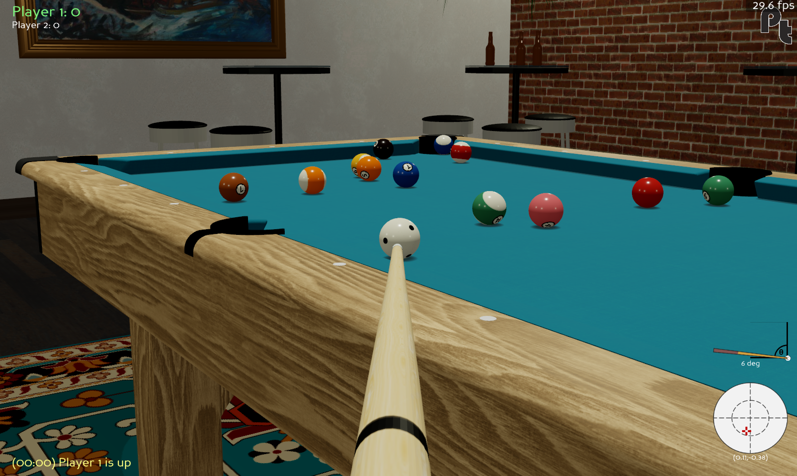{: style="width:800px; display:block; margin:0 auto; border:1px solid #ddd;"}

## **The physics of billiards**

---

the theoretical treatment of billiards has been sufficiently solved for most scenarios: 
 - **(1)** **ball-cloth** interactions, aka how the balls slide, spin, roll, and lie on the table; 
 - **(2)** **ball-ball** interactions aka how balls collide with one another; 
 - **(3)** **ball-cushion** interactions, aka how balls bounce off rails; 
 - **(4)** **ball-air** interactions, aka how the ball behaves when it becomes airborne due to jump shots, etc.; 
 - **(5)** **ball-slate** interactions, aka how the ball bounces on the table.

I'm pretty sure the above list covers every phenomenon that happens on (and off) the table. The jury is still out on the finer details of these interactions, but each of these individual scenarios have analytical solutions that are accurate to "sufficient" degree. What I mean by sufficient is that all qualitative effects a pro-player may be expecting to observe manifest directly from the equations.

**reference source：**
"_The Physics of Pocket Billiards_" by Wayland C. Marlow. The physics used in this post comes partly from this book, and partly from random sources on the internet.

出版社  :  American Institute of Physics
出版日期  :  1995年 1月 1日
版本  :  First Edition
语言  :  英语
纸书页数  :  291页
ISBN-10  :  0964537001
ISBN-13  :  978-0964537002

## **Section I**: ball-cloth interactions

---

In this section I review the ball-cloth interaction, aka how pool balls interact with their playing surface.

It is somewhat obvious that the cloth provides a frictional surface that slows the ball's motion. Yet, depending on the ball's spin state, this same friction also leads to curved trajectories due to the application of forces orthogonal to the ball's motion. So modelling the ball-cloth interaction is essential for realism, and quickly gets complicated.

some models from least to most realistic：

### (1) No friction

This is the null model. The friction coefficients at the point of contact (PoC) between ball and cloth are 0. This means no energy dissipates from the ball, and it rolls indefinitely. It also spins indefinitely.

### (2) Spinless ball

In this model, a frictional force exists between the cloth and ball that opposes the ball's motion. This means the ball dissipates energy over time and eventually come to a halt. Sounds like pool to me.

However, what's unrealistic about this model is that the ball has **no spin**, which is impossible for a ball moving on a cloth with friction. To see why, let's look at the force contributions that act on the ball:

{: style="width:70%; display: block; margin: 1em auto; border-radius:8px;"}

_**Figure 1**. Force contributions acting on a ball that has o spin. Here, $ \vec{v} $ is the velocity of the ball, $ m $ its mass, and $ R $ its radius.  Additionally, we got good old $ \vec{g} $, the gravitational constant, and the normal force $ \vec{N} $._

In this example, pretend the ball initially has no spin (*e.g.* it's not rolling) but is moving in the $ +x $-direction with a speed $ |\vec{v}| $.

In the $ y $-axis, there is a gravitational force (mass $ \times $ gravitational constant $ = m\vec{g} $) pulling the ball into the table. Since the table is supporting the ball, it exerts an equal and opposite force onto the ball. This is called the normal force, $ \vec{N} $. Without it, the ball would fall through the table. 

So even while the ball remains perfectly still on the table, there's a perpetual tug-of-war between the ball wanting to accelerate towards the center of the earth, and the table stopping it from doing so. This contention results in friction whenever the ball moves along the table. The ball and cloth essentially rub each other the wrong way as the ball moves, and so a frictional force is exerted on the ball in a direction opposite the ball's motion, that is denoted here as $ \vec{F}_f $.

So what makes the ball spin? Well, since $ \vec{F}_f $ is applied at the **point of contact (PoC)** between ball and cloth, this creates a torque on the ball that causes it to rotate. Intuitively, the bottom of the ball is slowing down, but the top of the ball isn't, so it ends up going head over heels.

To demonstrate this, I took a slow-mo shot of an object ball being struck head on with the cue ball.

{: style="width:70%; display: block; margin: 1em auto; border-radius:8px;"}

Friction-induced spin
  <a href="https://www.youtube.com/watch?v=8Wng2cUH8as"; style="text-decoration: underline">Youtube Video</a>

Directly after impact, the object ball has a non-zero velocity and no spin. But quickly over time,the ball transitions from sliding across the cloth (no spin) to rolling across the cloth (yes spin). I hope it's convincing footage.

Wrapping things up for this model, where spin is ignored, you can imagine that instead of the frictional force being applied at the PoC, it's applied at the ball's center. Then, there is no torque on the ball, and therefore no spin. This provides a mechanisms that slows the balls down, so it checks that box for realism.

Overall, this is the kind of model you can expect from a pool game that offers a primitive "overhead" perspective, since it provides a passable playing experience for beginners and is simple to code.

### (3) Ball with arbitrary spin

From this point on, I'll refer to a ball with **spin** as a ball with **angular velocity**.

In this example, I take on the general case of the ball-cloth interaction. This is the most realistic model I came across that can be solved analytically, and has the following assumptions:

1. The ball can be in an **arbitrary state** (but must be on the table)
2. There is a **single point of contact** (PoC) between ball and cloth

By *the ball can be in an arbitrary state*, what I mean is that it can have an：
 - arbitrary velocity $(\vec{v})$, 
 - angular velocity $(\vec{\omega})$, and 
 - displacement relative to some origin $(\vec{r})$. 
These **3 vectors** fully characterize the state of the ball.

The goal is to find equations of motion that can evolve these 3 vectors through time. Essentially, these equations are functions that, when given an initial state $(\vec{v}_0$, $\vec{\omega}_0$, $\vec{r}_0)$, can give you an updated state $(\vec{v}$, $\vec{\omega}$, $\vec{r})$ some time $t$ later.

As for the second assumption, a single point of contact is a fairly accurate assumption, but technically the weight of the ball bunches up the cloth as it moves. The amount of bunching up depends on how loosely the cloth is stretched over the slate. Additionally, the cloth itself can be compressed, and cloth fibers and other non-idealities can contact the ball at multiple points. And so in actuality there does not exist a **point of contact**, but rather, an **area of contact**.

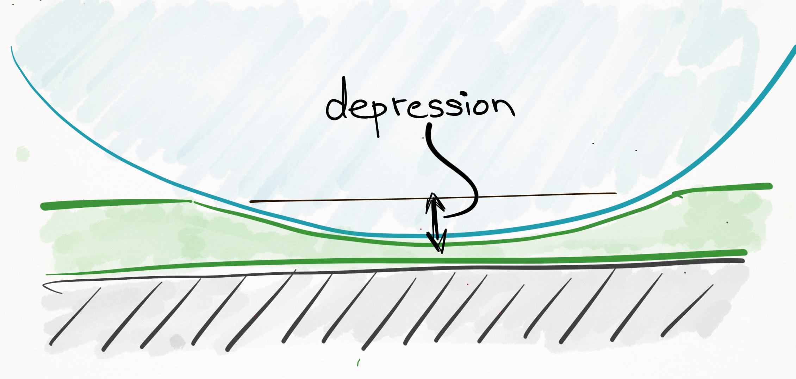{: style="width:70%; display: block; margin: 1em auto; border-radius:8px;"}

_**Figure 2**. The cloth is a compressible surface, and so in actuality there does not exist a "point of contact", but rather, an "area of contact"._

The most important thing to realize is that throughout a ball's trajectory, it will always be in **any of these 4 （5？）different modes**: 
 - **sliding**, 
 - **rolling**, 
 - **spinning**,
 - **stationary**, 
 - **airborne**
 (all of these states occur during the ball-cloth interaction, with the exception of the airborne state, which is covered [later on](#section-iv-ball-air-interactions)). The physics is different for each of these cases, so I tackle them piecewise from least to most complicated.

#### Case 1: Stationary

If the ball is stationary, the ball stays where it is and there is no angular or linear momentum. In other words:

**Stationary equations of motion**

   Displacement:

   
   $$ \vec{r}(t) = \vec{r}_0 \tag{1} $$

   Velocity:

   
   $$ \vec{v}(t) = \vec{0} \tag{2} $$

   Angular velocity:

   
   $$ \vec{\omega}(t) = \vec{0} \tag{3}$$

   Validity:

   $0 \le t < \infty$.

It's important to keep in mind each of Eqs. [(1)](#Displacement),[(2)](#Velocity), and [(3)](#Angular) are vector equations that can be broken down into 3 scalar equations each, one for each spatial dimension. For example, Eq. [(3)](#Angular) can be written as $\omega_x(t) = 0$, $\omega_y(t) = 0$, and $\omega_z(t) = 0$. I interchangeably use both scalar and vector equations, so make sure you are spotting the difference.

#### Case 2: Spinning

Spinning is a commonly observed ball state in which there is no linear momentum of the ball, yet it is spinning like a top:

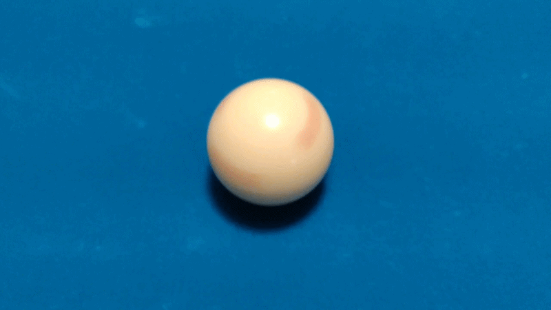{: style="width:70%; display: block; margin: 1em auto; border-radius:8px;"}

Spinning
  <a href="https://www.youtube.com/watch?v=A9mweRTxGiw"; style="text-decoration: underline">Youtube Video</a>

Like in the stationary state, the ball has no linear momentum:

$$ \vec{v}(t) = \vec{v} \notag $$

Likewise, the ball remains in place:

$$ \vec{r}(t) = \vec{r}_0 \notag $$

However, since the ball is rotating, it has an angular velocity. You'll notice that the ball spins around the $z-$axis, relative to the coordinate system in Figure 3:

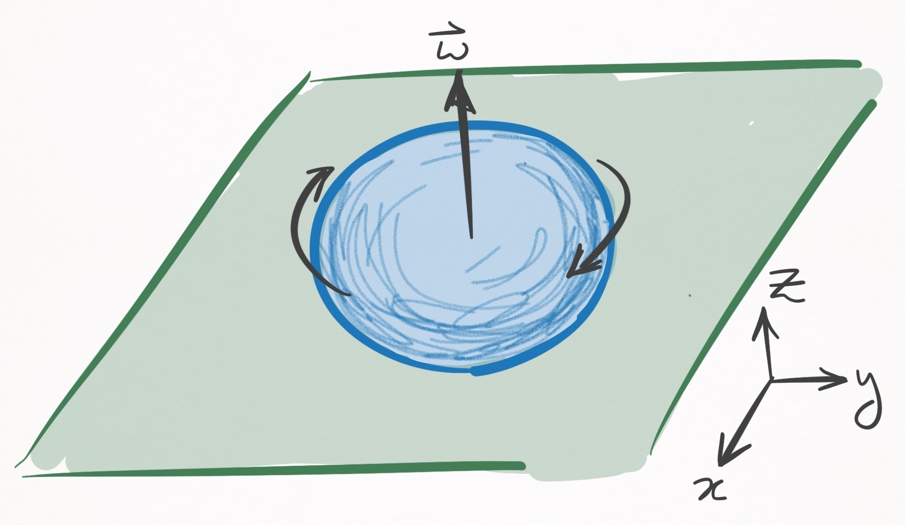{: style="width:70%; display: block; margin: 1em auto; border-radius:8px;"}

_**Figure 3**. A ball spinning in place. In this coordinate system the table is in the $xy-$plane._

Spinning around the $z-$axis is not by chance--it is a constraint of the state, since if the ball had any components of its angular velocity in the $x$ or $y$ directions, it would create a friction with the cloth that would translate into a linear velocity. Since spinning is characterized by 0 linear velocity $(\vec{v}=\vec{0})$, angular velocity is strictly in the $z-$axis. In other words,

$$ \omega_x(t) = 0 \notag $$

$$ \omega_y(t) = 0 \notag $$

$$ \omega_z(t) = \text{ }??? \notag $$

To characterize the $z-$axis angular velocity, I need to introduce some bull\*\*\*\*.

I told you that in this model, there is a single PoC between ball and cloth. If such were *truly* the case, there is nothing to stop the ball from spinning forever (besides air, which I will ignore).

This is because a ball spinning in place has **zero speed** at the infinitesimally small PoC. In other words, the relative velocity between the ball and cloth at the PoC is 0, and this means there can exist no frictional force.

Of course, everyone knows that the ball *does* slow, which is proof that there does not exist a point of contact but rather an area of contact.

Rather than explicitly define an area of contact, which would greatly complicate the physics, we account for this embarrassing blunder of the model by introducing a phenomenological friction parameter that slows down the $z-$component of the ball's angular velocity over time.

A phenomenological parameter, you say? It's a parameter that is added to a model *ad hoc*, that explains a phenomenon (in this case, the slowing down of a ball's rotation) that does not come from assumptions of the model. It's what people do when they want to model an observation but their model is bad and does not cause the observation. Basically, its cheating.

After adding a phony friction term, we have our equations of motion solved:

**Spinning equations of motion**

Displacement:
   
   $$ \vec{r}(t) = \vec{r}_0 \tag{4} $$

Velocity:
   
   $$ \vec{v}(t) = \vec{0} \tag{5} $$

Angular velocity:
   
   $$ \omega_x(t) = 0 \tag{6} $$
   
   $$ \omega_y(t) = 0 \tag{7} $$
   
   $$ \omega_z(t) = \omega_{0z} - \frac{5\mu_{sp}g}{2R}t \tag{8} $$

Validity:

$0 \le t \le \frac{2R}{5\mu_{sp}g}\omega_{0z}$.

In Eq. [(8)](#spinning_oz), $\omega_{0z}$ is angular velocity in the $z-$axis at $t=0$, $\mu_{sp}$ is the coefficient of spinning friction, $g$ is the gravitational constant, and $R$ is the ball's radius. The equation states that as time evolves, there is a linear decay in the ball's angular velocity. Collectively, these equations are valid until the ball stops rotating, which happens when $\omega_z(t)$ is $0$. This occurs when $t=(2R\omega_{0z})/(5\mu_{sp}g)$. [Why is 2/5](<Ref/Solid Sphere Mass Distribution Integration_ 2_5 Result.md>)

#### Case 3: Rolling

Think of rolling as driving your car on concrete, whereas sliding would be like driving your car on ice.

In the former, your tires grip the road such that at the point of contact, there is no relative velocity between the tire and the road; each time the tire does one rotation, your car translates the circumference of your tire.

But on ice, there is a lot of slippage between the tire and the ice, and therefore a relative velocity; each time your tire does one rotation, your car moves far less than one circumference of your tire.

In physics textbooks, what I call rolling is actually called _rolling without slippage_ and what I call sliding is actually called _rolling with slippage_. Sorry for the confusing terminology.

Alright, so let's get on with it. Consider a ball that is _rolling_ in the positive $x-$direction:

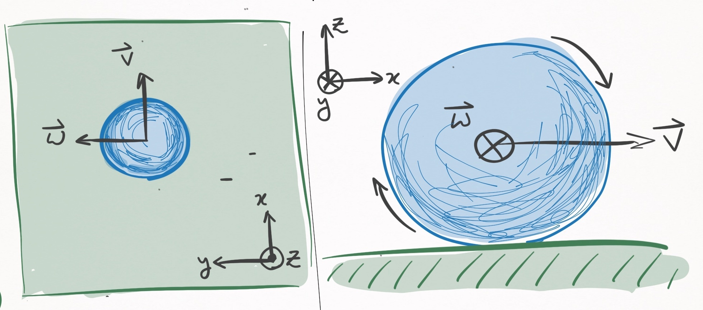{: style="width:70%; display: block; margin: 1em auto; border-radius:8px;"}

_**Figure 4**. A rolling ball, that moves in the $x-$direction. The left panel shows a bird's eye view, and the right panel shows a profile view. In this coordinate system, the angular velocity is in the $y-$direction._

Such a ball will move in a straight line until it comes to a rest. As it travels, it will be slowed down by a frictional force proportional to its velocity, which implies that its velocity will decay  linearly with time:

   
   $$ \vec{v}(t) = \vec{v}_0 - \mu_r g t \hat{v}_0 \tag{9} $$

Here, $\mu_r$ is the coefficient of rolling friction, $g$ is the gravitational constant, and $\hat{v}_0$ is the unit vector that points in the direction of the ball's travel (according to this coordinate system, $\hat{v}_0 = \hat{i}$).

Integrating this equation with respect to time yields the displacement as a function of time:

$$ \vec{r}(t) = \vec{r}_0 + \vec{v}_0 t - \frac{1}{2} \mu_r g t^2 \hat{v}_0 \notag$$

Now for angular velocity. To discuss this, I should formalize the concept of rolling, which is formally defined as the state in which the **relative velocity**, $\vec{u}(t)$, between the ball and cloth at the PoC is $\vec{0}$.

$\vec{u}(t)$ has two contributions: 
- (1) the linear velocity of the ball, _i.e._ the velocity of the center of mass, 
- (2) the velocity between ball and cloth that exists because of the ball's rotation. 

Their sum defines the relative velocity:

   
   $$ \vec{u}(t) = \vec{v}(t) + R \hat{k} \times \vec{\omega}(t) \tag{10} $$

For example, here is a shot where I tried to make sure the cue ball _only_ has linear velocity:

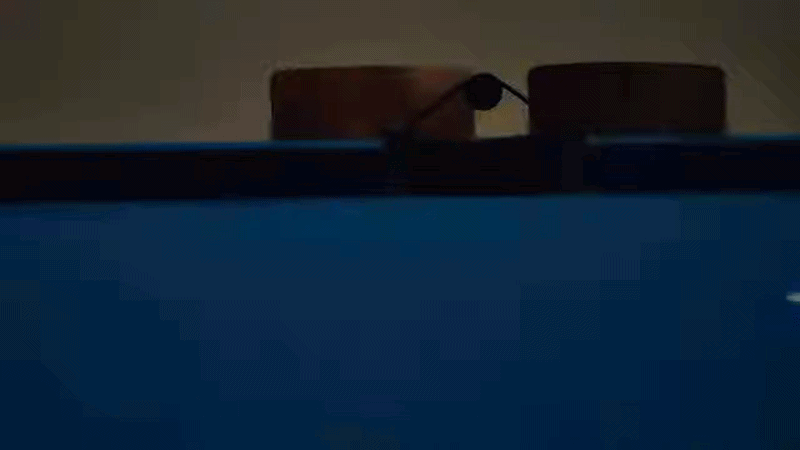{: style="width:70%; display: block; margin: 1em auto; border-radius:8px;"}

Only translation
  <a href="https://www.youtube.com/watch?v=Z7ghvKcEDIc"; style="text-decoration: underline">Youtube Video</a>

I think we all agree there is some amount of rotation, but let's just ignore it.

 
Since the ball does not rotate, there is no angular velocity, so Eq. [(10)](#rel_vel) reduces to

$$ \vec{u}(t) = \vec{v}(t) \notag $$

Similarly, here is a shot that _only_ has a velocity between ball and cloth only due to the ball's rotation.

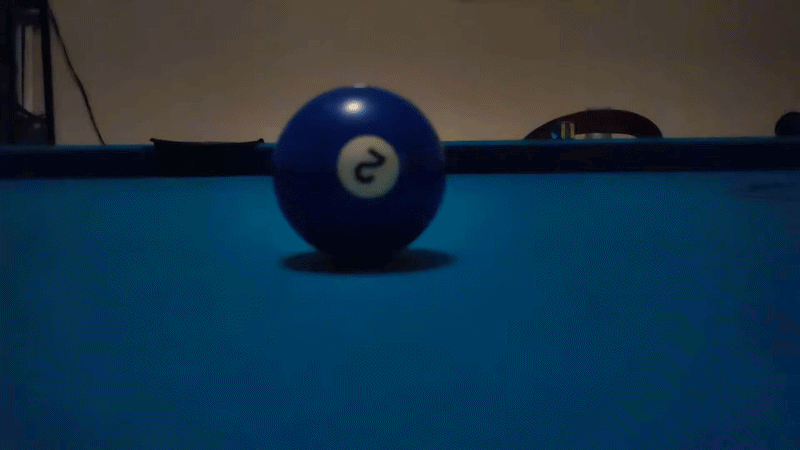{: style="width:70%; display: block; margin: 1em auto; border-radius:8px;"}

Rolling with slipping
  <a href="https://www.youtube.com/watch?v=G_aaXbdJavc"; style="text-decoration: underline">Youtube Video</a>

Right at the moment of contact, the cue ball spins _in place_ and therefore has no center of mass velocity. In this instant, Eq. [(10)](#rel_vel) becomes

$$ \vec{u}(t) = R \hat{k} \times \vec{\omega}(t) \notag $$

In the particular case shown, the ball has top spin, so the cross product dictates that $\vec{u}$ points in the direction opposite the cue ball's travel.

Both of the above examples are cases in which $\vec{u}(t) \ne \vec{0}$, so are therefore cases of sliding, not rolling. To be rolling $(\vec{u}(t) = \vec{0})$, these contributions must match each other:

   
   $$ -R \hat{k} \times \vec{\omega}(t) = \vec{v}(t) \tag{11} $$

This refers to the condition in which every time the ball does a complete rotation about the $y-$axis (according to the axes defined in [<u>**Figure 4**</u>](#Figure4)), the ball must travel exactly one circumference (aka $2 \pi R$ in the $x-$axis). Unless this exact condition is met, a moving ball is _sliding_, not _rolling_.

For how particular this condition seems, it is interesting that in the game of pool, balls are most often rolling. The reason is that any sliding ball experiences friction that reduces the magnitude of $\vec{u}(t)$ until it is rolling. In that sense, rolling is somewhat of an equilibrium state.

Now that there is a mathematical condition for rolling, _i.e._ Eq. [(11)](#roll_condition), there is a lot we can learn about the angular velocity. According to our coordinate system in [<u>**Figure 4**</u>](#Figure4), the RHS of Eq.[(11)](#roll_condition) is strictly in the $+x-$direction. That means the LHS must also be strictly in the $+x-$direction. Expanding the cross product on the LHS yields:

$$ -R\hat{k} \times \vec{\omega}(t) = R \begin{bmatrix} \omega_y(t) \\ -\omega_x(t) \\ 0 \end{bmatrix} \notag $$

3 really important things result from this equation:

  1. In order for the RHS to point in the $+x-$direction, as it must, $\omega_x(t)$ is necessarily 0. So no angular velocity in the direction of motion.

  2. Using Eq. [(11)](#roll_condition), it follows that $\omega_y(t) = |\vec{v}(t)|/R$. Since $\vec{v}(t)$ is known via Eq. [(9)](#rolling_velocity), this equation solves the time evolution of $\omega_y(t)$. Note that $\omega_y(t)$ is strictly positive, which intuitively refers to the fact that in order to be rolling, the ball must have _top spin_, not _back spin_.

  3. $\omega_z(t)$ is absent from this equation, which means that it is a _free parameter_: it can take any value.

Points 1 & 2 solve the time evolution for $\omega_x(t)$ and $\omega_y(t)$, respectively. Meanwhile, poin 3 has consequences that you may find highly surprising. For example, we know that in the rolling state, the ball path is a straight line. Yet the model predicts this is true regardless of $\omega_z$. Is that really sensical? It may not match your initial intuition, but it does match the reality:

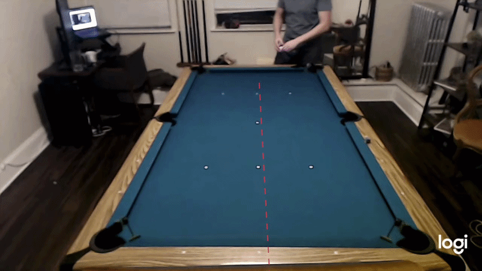{: style="width:70%; display: block; margin: 1em auto; border-radius:8px;"}

Straight-line trajectory even with sidespin
  <a href="https://www.youtube.com/watch?v=sDPNKuwax14"; style="text-decoration: underline">Youtube Video</a>

In the above example I apply a shit load of clockwise side spin $(\omega_z(t) < 0)$ and as you can see, the ball follows a straight line. Pretty hard to deny, but it might still be at odds with what you know about pool. For example, look at O'Sullivan and the gang "swerving" the ball by applying side spin:

<video controls 
    src="YouTubeEmbedded/6.All Swerve Snooker Shots 2016-2019 (Curve Ball Vertical Spin Masse).mp4" 
    style="width:800px; display:block; margin:0 auto;">
</video>

All Swerve Snooker Shots 2016-2019 (Curve Ball Vertical Spin Masse)
  <a href="https://www.youtube.com/watch?v=89g7sQ7zNqo"; style="text-decoration: underline">Youtube Video</a>

So what's the difference between those shots, and the one I manufactured? The fundamental difference is that these players are elevating their cue, which causes $\omega_x$ to be non-zero (angular velocity _in the direction_ of motion). This "barrel-roll" rotation is what causes curved trajectories, otherwise known as swerve or masse. (More on the cue-ball interaction later). On the other hand, my shot did not have any significant amount of $\omega_x$, so whatever small amount existed quickly dissipated within fractions of a second, yielding an otherwise straight trajectory.

The takeaway is that $\omega_z(t)$ is decoupled from everything else, and evolves according to Eq. [(8)](#spinning_oz), which was dealt with in Case 2. The only thing left to do is write down the equations for a given frame of reference. Let's use a frame of reference that is centered about the ball's _initial_ center of mass coordinates. Then,

Displacement:

   
   $$ \vec{r}(t) = (v_0 t - \frac{1}{2} \mu_r g t^2) \, \hat{v}_0 \tag{12} $$

Velocity:
   
   $$ \vec{v}(t) = (v_0 - \mu_r g t) \, \hat{v}_0  \tag{13} $$

Angular velocity:
   
   $$ \vec{\omega}_{xy}(t) = \hat{k} \times \frac{\vec{v}(t)}{R} \tag{14} $$

   
   $$ \omega_z(t) = \omega_{0z} - \frac{5\mu_{sp}g}{2R}t \tag{15} $$

where $v_0$ is the initial speed of the ball. Since angular velocity has 2 decoupled components,$\vec{\omega}(t)$ is represented by 2 equations.  $\vec{\omega} _{xy} (t)$ defines the angular velocity projected onto the $xy-$plane, which is parallel with the table. 

The above equations are defined in terms of $\hat{v}_0$, which can point direction in the $xy-$plane. If I take a frame of reference in which ball motion is in the $+x-$direction, I can drop the vector notation:

**Rolling equations of motion (ball coordinates)**

Displacement:
   
   $$ r_x(t) = v_0 t - \frac{1}{2} \mu_r g t^2 \tag{16} $$

   
   $$ r_y(t) = 0 \tag{17} $$

   
   $$ r_z(t) = 0 \tag{18} $$

Velocity:

   
   $$ v_x(t) = v_0 - \mu_r g t \tag{19} $$

   
   $$ v_y(t) = 0 \tag{20} $$

   
   $$ v_z(t) = 0 \tag{21} $$

Angular velocity:

   
   $$ \omega_x(t) = 0 \tag{22} $$

   
   $$ \omega_y(t) = \frac{v_x(t)}{R} \tag{23} $$

   
   $$ \omega_z(t) = \omega_{0z} - \frac{5\mu_{sp}g}{2R}t \tag{24} $$

Validity:

$0 \le t \le \frac{\lvert \vec{v}_0 \rvert}{\mu_r g}$. If $\frac{2R}{5\mu _{sp} g}
\omega _{0z} < \frac{\lvert \vec{v}_0 \rvert}{\mu_r g}$, then $\omega_z(t) = 0$ for $t >
\frac{2R}{5\mu _{sp} g} \omega _{0z}$.

The chosen frame of reference (centered at ball's initial coordinates, x-axis in direction of motion) is convenient, but annoying to deal when you are interested in knowing how the ball evolves **in relation to the table coordinates**. Suppose $\hat{v}_0$ relates to the table in the following way:

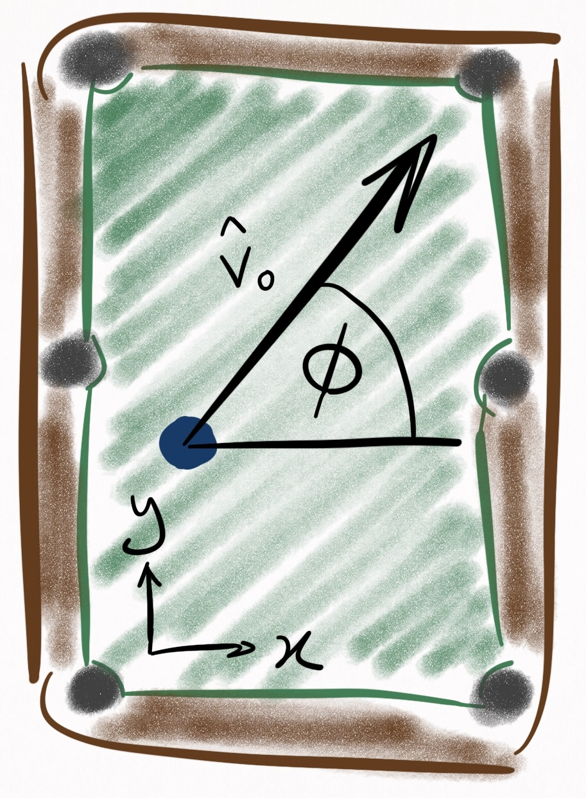{: style="width:25%; display: block; margin: 1em auto; border-radius:8px;"}

_**Figure 5**. Coordinate system in which the table is described. $\phi$ relates the ball's unit vector of motion, $\hat{v}_0$, to the table coordinates. The origin (0,0) is the bottom left pocket._

Then $\hat{v}_0$ can be expressed in terms of the table coordinates via the following rotation matrix:

   
   $$
   R = \begin{bmatrix}
      \cos\phi & -\sin\phi & 0 \\
      \sin\phi & \cos\phi & 0 \\
      0 & 0 & 1
   \end{bmatrix}
   \tag{25} $$

We can rotate Eqs. [(16)](#rolling_rx_ball)-[(24)](#rolling_oz_ball) via Eq. [(25)](#rot_mat) and subsequently add an initial displacement vector $\vec{r}_0$ to Eqs. [(16)](#rolling_rx_ball)-[(18)](#rolling_rz_ball) in order to rewrite the rolling equations of motion in the table coordinate system:

Rolling equations of motion (**table coordinates**)

Displacement:

   
   $$ r_x(t) = r_{0x} + v_0 \cos(\phi) \, t - \frac{1}{2} \mu_r g \cos(\phi) \, t^2 \tag{26} $$

   
   $$ r_y(t) = r_{0y} + v_0 \sin(\phi) \, t - \frac{1}{2} \mu_r g \sin(\phi) \, t^2 \tag{27} $$

   
   $$ r_z(t) = 0 \tag{28} $$

Velocity:

   
   $$ v_x(t) = v_0 \cos(\phi) - \mu_r g \cos(\phi) \, t \tag{29} $$

   
   $$ v_y(t) = v_0 \sin(\phi) - \mu_r g \sin(\phi) \, t \tag{30} $$

   
   $$ v_z(t) = 0 \tag{31} $$

Angular velocity:

   
   $$ \omega_x(t) = - \frac{1}{R} \lvert \vec{v}(t) \rvert \sin(\phi) \tag{32} $$

   
   $$ \omega_y(t) = \frac{1}{R} \lvert \vec{v}(t) \rvert \cos(\phi) \tag{33} $$

   
   $$ \omega_z(t) = \omega_{0z} - \frac{5\mu_{sp}g}{2R}t \tag{34} $$

Validity:

$0 \le t \le \frac{\lvert \vec{v}_0 \rvert}{\mu_r g}$. If $\frac{2R}{5\mu _{sp} g} \omega _{0z} < \frac{\lvert \vec{v}_0 \rvert}{\mu_r g}$, then $\omega_z(t) = 0$ for $t > \frac{2R}{5\mu _{sp} g} \omega _{0z}$.

#### Case 4: Sliding

If you're ended up here without reading Case 3 (the rolling case), you might consider briefing specifically the section on relative velocity, otherwise this won't make any sense.

Sliding occurs whenever there is a non-zero relative velocity, $\vec{u}(t)$, between the ball and cloth at the point of contact. If you need to know whether you're sliding, take this zaney flowchart questionnaire:

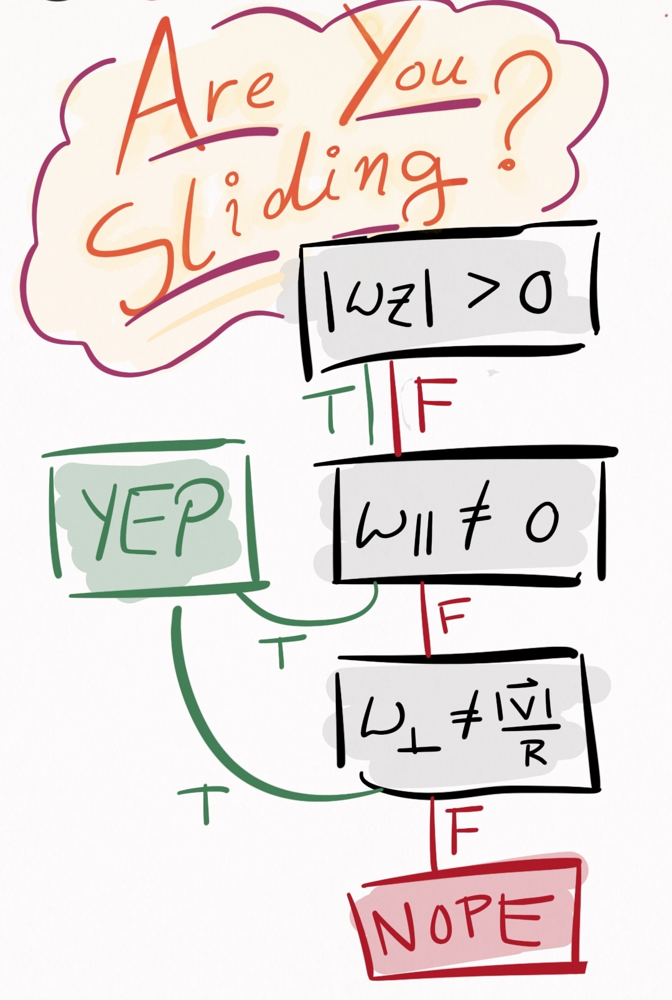{: style="width:30%; display: block; margin: 1em auto; border-radius:8px;"}

_**Figure 6**. Determine whether or not you are sliding.  $\lvert \vec{v} \rvert$ is the speed of the ball, $\omega _{\parallel}$ is the angular velocity in the direction of motion, and $\omega _{\bot}$ is the angular velocity that is both orthogonal to the direction of motion and parallel to the table. Note that as discussed in Case 3, $\omega_z$ does not influence $\vec{u}(t)$, and therefore has no impact on whether or not you are sliding._

If there is any curvature whatsoever in the trajectory of a ball, it occurs while the ball is sliding (assuming the table is perfectly level). If you shoot a draw or stun shot, the cue ball is sliding. Directly after an object ball is struck by the cue ball, it is in a sliding state until friction with the cloth drives it into the rolling state. Starting to get the idea? Good.

What separates the sliding case from the rolling case is that $\vec{u}(t)$ can point in any direction in the $xy-$plane. The most important thing to note about this case is that whichever direction $\vec{u}(t)$ points, a frictional force opposes it. This can lead to curved trajectories. To see how, consider [<u>**Figure 7**</u>](#Figure7), in which a ball is initially moving in the $+x-$direction, along with angular velocity also in the $+x-$direction. This is the kind of spin that a screw has when screwed into wood, where the spin of the screw is about the same axis as the axis of motion--a rather unrealistic spin to impart on a ball in the game of pool, but useful for the purposes of demonstration:

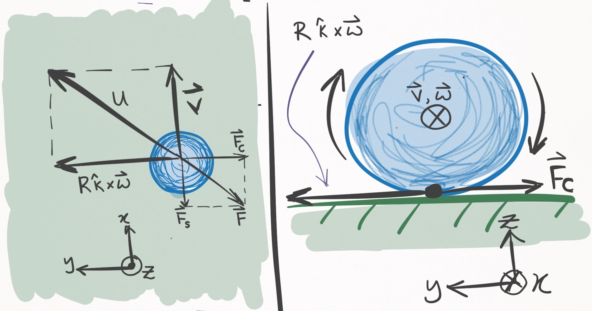{: style="width:50%; display: block; margin: 1em auto; border-radius:8px;"}

_**Figure 7**. A ball moving in the $+x-$direction with angular velocity also in the $+x-$direction. The left panel shows a bird's eye view, and the right panel shows a side view of the table and ball, as if looking down the barrel of the cue stick. Because $\vec{\omega}(t)$ is parallel to $\vec{v}(t)$, the $R \hat{k} \times \vec{\omega}(t)$ component in Eq. [(10)](#rel_vel) is orthogonal to $\vec{v}(t)$. The below paragraph defines the force terms._

I am used to thinking about friction opposing the ball's center of mass motion, and that frictional force is still present in the sliding case and is shown in [<u>**Figure 7**</u>](#Figure7) as $\vec{F}_S$ (straight-line force).  Yet, the $R \hat{k} \times \vec{\omega}(t)$ contribution to $\vec{u}(t)$ (see Eq. [(10)](#rel_vel)) also creates a frictional force, $\vec{F}_C$ (curved-line force). The sum of these two force terms, $\vec{F} = \vec{F}_C + \vec{F}_S$, yields the net frictional force manifesting from the ball-cloth interaction, and is anti-parallel to the relative velocity, $\vec{u}(t)$. (Note that because $\vec{\omega}(t)$ was exactly parallel to $\vec{v}(t)$, $\vec{F}_C$ and $\vec{F}_S$ are orthogonal, but in general this is not true). Since there exists a force component, $\vec{F}_C$, which is orthogonal to the ball's velocity, **this ball will begin curving to the right** (the negative $y-$direction)! The ball will continue to curve until $|\vec{u}(t)| \rightarrow 0$, at which point the ball enters the rolling state, where it will spend the rest of its days transiting a line. The equation governing $|\vec{u}(t)| \rightarrow 0$ is

   
   $$ \vec{u}(t) = (u_0 - \frac{7}{2} \mu_s g t ) \, \hat{u}_0 \tag{35} $$

where $u_0$ is the magnitude of $\vec{u}(t=0)$ and $\mu_s$ is the sliding coefficient of friction.

To establish the equations of motion for the sliding case, let's again use a frame of reference centered about the ball's _initial_ center of mass coordinates. Additionally, I assume the _initial_ center of mass velocity, $\vec{v}(0)$, points in the $+x-$direction. Then,

**Sliding equations of motion (ball coordinates)**

Displacement:

   
   $$ \vec{r}(t) = \vec{v}_0 \, t - \frac{1}{2} \mu_s g t^2 \, \hat{u}_0 \tag{36} $$

Velocity:

   
   $$ \vec{v}(t) = \vec{v}_0 - \mu_s g t \, \hat{u}_0  \tag{37} $$

Angular velocity:

   
   $$ \vec{\omega}_{xy}(t) = \vec{\omega}_{0xy} - \frac{5 \mu_s g}{2 R} \, t \, (\hat{k} \times \vec{u}_0) \tag{38} $$

   
   $$ \omega_z(t) = \omega_{0z} - \frac{5\mu_{sp}g}{2R}t \tag{39} $$

Validity:

$0 \le t \le \frac{2}{7}\frac{u _0}{\mu _s g}$. If $\frac{2R}{5\mu _{sp} g} \omega _{0z} < \frac{2}{7}\frac{u _0}{\mu _s g}$, then $\omega_z(t) = 0$ for $t > \frac{2R}{5\mu _{sp} g} \omega _{0z}$.

These are essentially the same as the rolling equations, except the acceleration terms in the $xy-$plane act in the $\hat{u}_0$ direction instead of the $\hat{v}_0$ direction, and the rolling coefficient of friction $\mu_r$ is replaced with the sliding coefficient of friction $\mu_s$.

We can express these in table coordinates by applying the rotation matrix (Eq. [(25)](#rot_mat)),which yields

**Sliding equations of motion (table coordinates)**

Displacement:

   
   $$ r_x(t) = r_{0x} + v_0 \cos(\phi) \, t \ - \frac{1}{2} \mu_s g \, ( u_{0x} \cos(\phi) - u_{0y} \sin(\phi) ) \, t^2 \tag{40} $$

   
   $$ r_y(t) = r_{0y} + v_0 \sin(\phi) \, t \ - \frac{1}{2} \mu_s g \, ( u_{0x} \sin(\phi) + u_{0y} \cos(\phi) ) \, t^2 \tag{41} $$

   
   $$ r_z(t) = 0 \tag{42} $$

Velocity:

   
   $$ v_x(t) = v_0 \cos(\phi) \ - \mu_s g \, ( u_{0x} \cos(\phi) - u_{0y} \sin(\phi) ) \, t \tag{43} $$
   
   $$ v_y(t) = v_0 \sin(\phi) \ - \mu_s g \, ( u_{0x} \sin(\phi) + u_{0y} \cos(\phi) ) \, t \tag{44} $$

   
   $$ v_z(t) = 0 \tag{45} $$

Angular velocity:

   
   $$
   \omega_x(t) = \omega_{0x} \cos(\phi) - \omega_{0y} \sin(\phi) \ + \frac{5 \mu_s g}{2R} (u_{0y} \cos(\phi) + u_{0x} \sin(\phi)) \, t\tag{46} $$

   
   $$
   \omega_y(t) = \omega_{0x} \sin(\phi) + \omega_{0y} \cos(\phi) \ + \frac{5 \mu_s g}{2R} (u_{0y} \sin(\phi) - u_{0x} \cos(\phi)) \, t\tag{47} $$

   
   $$ \omega_z(t) = \omega_{0z} - \frac{5\mu_{sp}g}{2R}t \tag{48} $$

Validity:

$0 \le t \le \frac{2}{7}\frac{u _0}{\mu _s g}$. If $\frac{2R}{5\mu _{sp} g} \omega _{0z} < \frac{2}{7}\frac{u _0}{\mu _s g}$, then $\omega_z(t) = 0$ for $t > \frac{2R}{5\mu _{sp} g} \omega _{0z}$.

This concludes the section of ball-cloth interactions, at least for now.

## **Section II**: ball-ball interactions

---

This section is dedicated to the collision physics between two balls.

When physically modelling a phenomenon, the sky is the limit in terms of how real you want to get. In consideration of the ball-ball interaction, a complete classical description would entail treating the balls as compressible objects--perhaps even modelling the pressure waves that emanate within each ball during a collision. Perhaps this treatment is most necessary during the break shot, and I would be very interested to know how the degree of realism of such a treatment compares to the more pragmatic approaches I will be taking. Speaking of which, here are the two models I will present:

  1. Elastic, instantaneous, frictionless
  2. Elastic, instantaneous (TODO)

In each of these models, multi-ball collisions are not considered, _i.e._ each interaction is pairwise.

###  (1) Elastic, instantaneous, frictionless

In this model, collisions are perfectly elastic, which means no energy dissipates as a result of the collision. This is not true for several reasons. First of all, pool balls make noise when they collide, and those sound waves are a form of energy dissipation from the system. Then there is heat generated via the collision, another form of energy dissipation. Are there more instances of energy dissipation? Those are the ones I can think of anyways.

Another assumption is that the balls interact instantaneously. Like everything, pool balls are viscoelastic objects and have some minute degree of compressibility. When objects compress, they exhibit a spring-like response, like how this bouncy ball compresses into the ground:

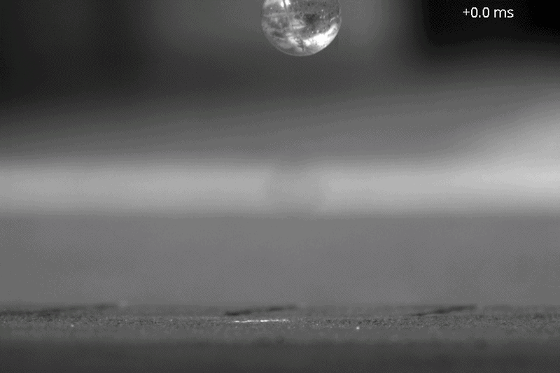{: style="width:70%; display: block; margin: 1em auto; border-radius:8px;"}

Ball bouncing in slow motion：Bouncy ball
  <a href="https://www.youtube.com/watch?v=tTt886y0rWI"; style="text-decoration: underline">Youtube Video</a>

As seen in the clip, this creates an interaction between the bouncy ball and the ground that lasts a finite period of time. Pool balls are subject to the same phenomenon, to a degree orders of magnitude less exaggerated. However slight the effect may be, in reality pool balls interact over a finite period of time, a time that this model will ignore.

The final assumption is that the ball-ball interaction is frictionless, _i.e._ perfectly slippery. This implies that there is no transfer of spin from one ball to another, which is commonly known as throw.

The frictionless assumption is the worst of these assumptions, since friction between balls is what causes spin- and cut-induced throw, which are effects that exhibit substantial influence on shot outcome, and must be accounted for by amateurs and pros alike. In the next model, I will account for friction between balls.

For this model, I first tackle the simple scenario in which a moving ball strikes a stationary ball. Then, I handle the general case of 2 moving balls.

#### Case 1: stationary ball

Assuming the elastic, instantaneous, and frictionless model, consider a moving ball that hits a stationary ball, shown in Figure 8:

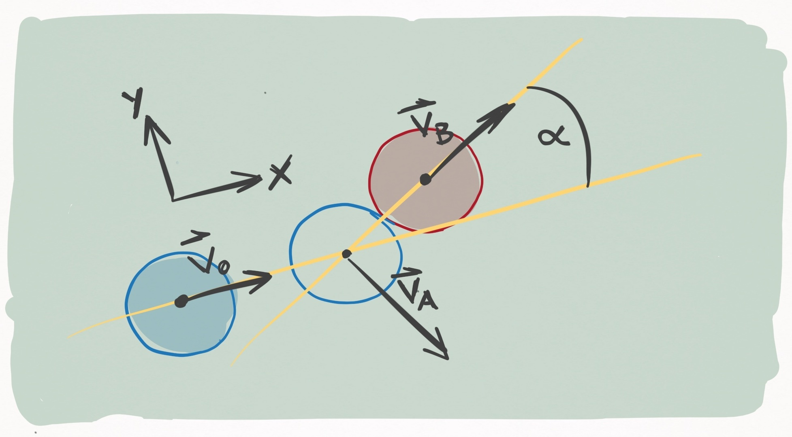{: style="width:70%; display: block; margin: 1em auto; border-radius:8px;"}

_**Figure 8**. Ball A (blue) strikes ball B (red) with an incoming velocity $\vec{v}_0$ in the $+x-$direction. The unfilled circle shows where ball A ends up striking ball B. During contact, the line connecting the centers of the two balls (the line of centers) forms an angle $\alpha$ with $\vec{v}_0$. The outgoing velocity of ball B, $\vec{v}_B$, runs along the line of centers, and the outgoing velocity of ball A, $\vec{v}_B$, is perpendicular to $\vec{v}_B$._

If we imagine that Ball A is the cue ball and ball B is an object ball, this represents a "cut shot" of $\alpha$ degrees. We would like to know how to resolve this collision. What do I mean by "resolve"? I mean, Given the state of the balls the moment _before_ the collision, what is the state of the balls the moment _after_ the collision. Just like in [Section I](#section-i-ball-cloth-interactions), the state of a ball is defined by its position, velocity,and angular velocity.

Some of these I can bang out right away. Suppose the collision happens between $t = \tau$ and $t = \tau + dt$, keeping in mind instantaneity of the collision dictates that $dt$ is infinitesimally small. There is thus no amount of time for the balls to change position in the moments immediately before and after the collision. Therefore

$$ \vec{r}_A(\tau+dt) = \vec{r}_A(\tau) \notag $$

$$ \vec{r}_B(\tau+dt) = \vec{r}_B(\tau) \notag $$

One down. Since I'm not accounting for friction effects, there is no loss or change in angular velocity due to the collision:

$$ \vec{\omega}_A(\tau+dt) = \vec{\omega}_A(\tau) \notag $$

$$ \vec{\omega}_B(\tau+dt) = \vec{\omega}_B(\tau) \notag $$

Two down. This leaves only the velocities of the balls, which certainly do change. To solve the outgoing velocities, I'm going to need some conservation of momentum and energy. [<u>**Figure 8**</u>](#Figure8) details the scenario above. For convenience, the coordinate system is defined so that $\vec{v}_0$ points in the $+x-$direction.

Before getting into equations, what's clear immediately is that we know the outgoing direction of Ball B just from geometry: it is parallel to the line that connects the centers of the balls at the moment of impact. That's because this line marks the direction of force that Ball A applies to Ball B. Now, let's figure out the outgoing direction of Ball B.

According to conservation of linear momentum, the momentum before the collision equals the momentum after it:

$$ m\vec{v}_0 = m\vec{v}_A + m\vec{v}_B \notag $$

$$ \vec{v}_0 = \vec{v}_A + \vec{v}_B \tag{49} $$

Concurrently, conservation of energy states that the energy before the collision equals the energy after it

$$ E(\tau) = E(\tau + dt) \tag{50} $$

Since the model ignores angular momentum transfer, we need only account for the kinetic energy resulting from linear translation of the balls. Plugging kinetic energy terms into Eq. [(50)](#con_energy) yields

$$ \frac{1}{2} m \lvert \vec{v}_0 \rvert ^2 = \frac{1}{2} m \lvert \vec{v}_A \rvert ^2 + \frac{1}{2} m \lvert \vec{v}_B \rvert ^2 \notag $$

$$ \lvert \vec{v}_0 \rvert ^2 = \lvert \vec{v}_A \rvert ^2 + \lvert \vec{v}_B \rvert ^2 \notag $$

$$ \vec{v}_0 \cdot \vec{v}_0 = \lvert \vec{v}_A \rvert ^2 + \lvert \vec{v}_B \rvert ^2 \tag{51} $$

Plugging Eq. [(49)](#p_1) into the LHS of Eq. [(51)](#E_1) yields something very interesting:

$$ (\vec{v}_A + \vec{v}_B) \cdot (\vec{v}_A + \vec{v}_B) = \lvert \vec{v}_A \rvert ^2 + \lvert \vec{v}_B \rvert ^2 \notag $$

$$ \lvert \vec{v}_A \rvert ^2 + \lvert \vec{v}_B \rvert ^2  +  2 \, \vec{v}_A \cdot \vec{v}_B = \lvert \vec{v}_A \rvert ^2 + \lvert \vec{v}_B \rvert ^2 \notag $$

$$ \vec{v}_A \cdot \vec{v}_B = 0 \tag{52} $$

The inner product of $\vec{v}_A$ and $\vec{v}_B$ is 0, which means that outgoing velocities of the 2 balls are $90^{\circ}$ to one another! Since the direction of $\vec{v}_B$ is known from geometry, the direction of $\vec{v}_A$ is known as well. To determine the magnitudes, I superpose the 3 velocity vectors on top of each other:

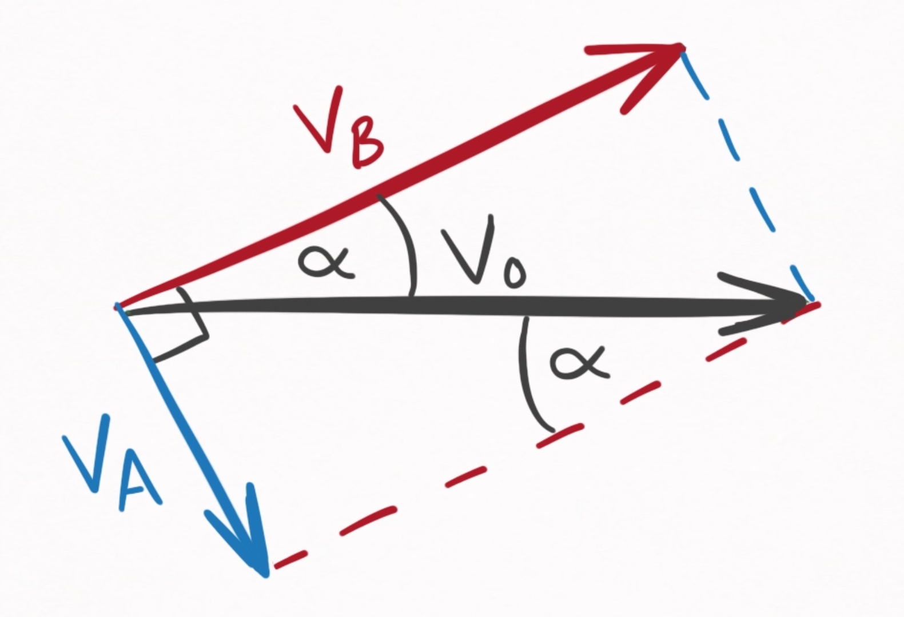{: style="width:70%; display: block; margin: 1em auto; border-radius:8px;"}

_**Figure 9**. Geometrical relationships between $\vec{v}_0$, $\vec{v}_A$, and $\vec{v}_B$._

This diagram contains 3 critical pieces of information.

  1. $\vec{v}_B$ makes an angle, $\alpha$, with the incoming velocity, $\vec{v}_0$. This is known because Ball A imparts an impulse to Ball B in the direction parallel to the line connecting their two centers of mass.

  2. The sum of $\vec{v}_A$ and $\vec{v}_B$ is $\vec{v}_0$. This is known from Eq. [(49)](#p_1), the conservation of linear momentum.

  3. $\vec{v}_A$ is perpendicular to $\vec{v}_B$. This is known from Eq. [(52)](#perp), which used both conservation of energy and linear momentum.

Given these facts, I can soh-cah-toa my way to the answer. Expressed in terms of $\alpha$ and $v_0$, I get:

$$ \vec{v}_A(t+\tau) = (v_0 \sin\alpha) \, \hat{v}_A \notag $$

$$ \vec{v}_B(t+\tau) = (v_0 \cos\alpha) \, \hat{v}_B \notag $$

Putting it all together, we have our equations for the elastic, instantaneous, and frictionless ball-ball collision in the specific case where one ball is stationary:

**Elastic, instantaneous, frictionless ball-ball collision (stationary case)**

Displacement:

   
   $$ \vec{r}_A(\tau+dt) = \vec{r}_A(\tau) \tag{53} $$

   
   $$ \vec{r}_B(\tau+dt) = \vec{r}_B(\tau) \tag{54} $$

Velocity:

   
   $$ \vec{v}_A(t+\tau) = (v_0 \sin\alpha) \, \hat{v}_A \tag{55} $$

   
   $$ \vec{v}_B(t+\tau) = (v_0 \cos\alpha) \, \hat{v}_B \tag{56} $$

Angular velocity:

   
   $$ \vec{\omega}_A(\tau+dt) = \vec{\omega}_A(\tau) \tag{57} $$

   
   $$ \vec{\omega}_B(\tau+dt) = \vec{\omega}_B(\tau) \tag{58} $$

#### Case 2: both moving

Relaxing the assumption that one ball is stationary may at first seem like a terrible idea--the introduced complexity must be horrible.

And that intuition is basically correct. Treating both balls as moving would be a nightmare. Yet even when both balls are moving, I don't need to _treat_ it that way. Instead, I can change to a frame of reference that moves with one of the balls. In such a frame of reference, that ball is stationary. A picture of the situation is shown in Figure 10:

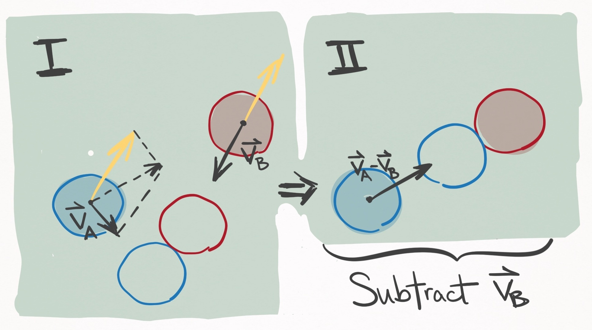{: style="width:70%; display: block; margin: 1em auto; border-radius:8px;"}

_**Figure 10**. In the left panel, Ball A (blue) and Ball B (red) are both moving and due to collide at the position of the unfilled circles. If $\vec{v}_B$ is subtracted from the velocities of both balls (see yellow vectors), the frame of reference is changed to one that moves with ball B, shown in the right panel. In this scenario, ball B is stationary, and the situation reduces to Case 1, and specifically the situation depicted in Figure 8._

In Figure 10 panel II, the balls should contact with the same orientation as shown in panel I (about $50^{\circ}$ to the $x-$axis), rather than as pictured.

Since physics behaves the same as viewed from all inertial reference frames, I am well within my rights to make this transformation during the collision. After solving the outgoing state post-collision, I can reverse the transformation and voila, I'm done. This makes Case 2 trivial, since it can be reduced to Case 1. Explicitly, the procedure goes like this:

**Elastic, instantaneous, frictionless ball-ball collision (both moving)**

First, make the following transformation so Ball B is stationary:

$$ \vec{v}_B'(\tau) = \vec{v}_B(\tau) - \vec{v}_B(\tau) = \vec{0} \tag{59} $$

$$ \vec{v}_A'(\tau) = \vec{v}_A(\tau) - \vec{v}_B(\tau) \tag{60} $$

The velocities of the collisions are resolved via Eqs. [(55)](#vA_simple) and [(56)](#vB_simple), where Eq. [(60)](#trans_A) is substituted as $\vec{v}_0$. This yields post-collision velocity vectors $\vec{v}_A'(\tau + dt)$ and $\vec{v}_B'(\tau + dt)$, which can be transformed back to the table frame of reference via the inverse transformation (adding back $\vec{v}_B(\tau)$):

$$ \vec{v}_A(\tau + dt) = \vec{v}_A'(\tau + dt) + \vec{v}_B(\tau) \tag{61} $$

$$ \vec{v}_B(\tau + dt) = \vec{v}_B'(\tau + dt) + \vec{v}_B(\tau) \tag{62} $$

## **Section III**: ball-cushion interactions

The ball-cushion interaction is probably the most difficult to model accurately. There are so many factors to consider. The height, shape, friction, and compressibility of the cushion. The incoming angle, velocity, and spin of the ball. All of these have significant effects on how the rail influences the ball's outgoing state. Let's take a look in slow motion:

{: style="width:70%; display: block; margin: 1em auto; border-radius:8px;"}

Balls and Cushion Interaction
  <a href="https://www.youtube.com/watch?v=yWH-CbV6BwQ"; style="text-decoration: underline">Youtube Video</a>

First, you can really see that the rail deforms substantially throughout its interaction with the ball.

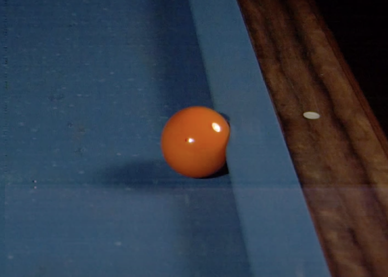{: style="width:70%; display: block; margin: 1em auto; border-radius:8px;"}

*Pool ball significantly deforming the cushion [Source](https://www.youtube.com/watch?v=yWH-CbV6BwQ).*

The implication is two-fold.

First, the interaction is non-instantaneous. In fact, it persists far longer than the ball-ball interaction. Yet finite-time interactions open up a can of worms for multi-body dynamics, since a second ball may join the party and collide with the first ball whilst it is interacting with the cushion.

For this reason, along with the inherent complexity of the soft-body physics, modelling the interaction as non-instantaneous is likely unfeasible.

Second,there is no single point of contact (PoC) between ball and cushion. Rather, the interaction occursover a line of contact (LoC), each infinitesimal segment of which contributes to the applied force.

These complexities are why **the ball-cushion interaction is the least accurately modelled aspect ofpool physics simulations**.

Did you notice that the ball pops into the air post-collision? This happens because the apex of the cushion is at a height greater than the ball's radius, and so the outgoing velocity of the ball has a component that goes _into_ the table. Consequently, the slate of the table applies a normal force to the ball, **popping it up into the air**.

Importantly, I want to distinguish between the ball-slate interaction and the ball-cushion interaction: the ball-cushion interaction creates the outgoing velocity of the ball, which under most circumstances has a component _into_ the table. An infinitesimally small amount of time later, the ball-slate
interaction occurs, which prevents translation into the table's surface, and in some cases pops the ball into the air if its speed is great enough. This section deals strictly with the ball-cushion interaction, and in the next section I will treat the ball-slate interaction.

Given the complexity of the ball-cushion interaction, I must admit I feel a little in over my head. So far, I have considered 3 models: Mathavan _et. al_,
2010; Marlow, 1994; Han, 2005. Let's take a look.

### (1) Mathavan <i>et. al</i>, 2010

After searching the literature, the most complete treatment I have found is [this work by Mathavan _et. al_ (2010)](https://www.researchgate.net/publication/245388279_A_theoretical_analysis_of_billiard_ball_dynamics_under_cushion_impacts) entitled, "_A theoretical analysis of billiard ball dynamics under cushion impacts_". They develop a model that must be solved numerically using differential equations, which is relatively complex. To get a rough idea of how involved this model is, check out the force body diagram in Figure 4:

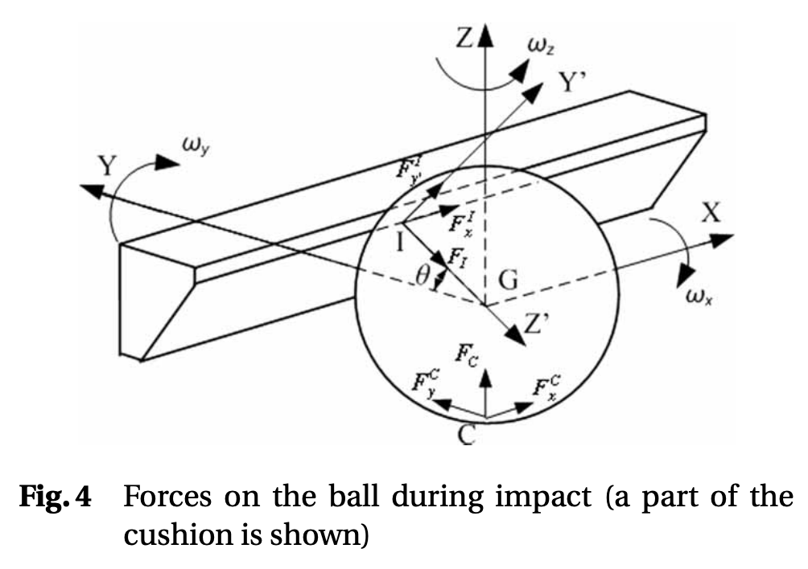{: style="width:70%; display: block; margin: 1em auto; border-radius:8px;"}

_Force body diagram from Mathavan et. al, 2010. [source](https://www.researchgate.net/publication/245388279_A_theoretical_analysis_of_billiard_ball_dynamics_under_cushion_impacts)_

This is the kind of thing that takes a long time to wrap your ahead around the meaning of the variables. Despite the model's complexity, it is still very simple in comparison to reality because it assumes the cushion deformation is insignificant, and thus the interaction instantaneous. Despite this being a large departure from reality, they report really good agreement with experiment.

This is definitely the best model I could find that I would be willing to implement, but at this moment in time I don't _really_ want to solve differential equations on-the-fly every time there is a ball-cushion interaction. Perhaps I could solve the differential equations for the entire parameter
space and then parameterize the solution space somehow, but for now I would like to avoid this model altogether and look for something simpler.

### (2) Marlow, 1994

So Marlow has a book called "The Physics of Pocket Billiards" that I use as a reference for pool physics. In general, its very comprehensive, but in the case of the ball-cushion interaction he presents an incomplete and inconsistent treatment. Moving on.

### (3) Han, 2005

I enjoy [this treatment by Han, 2005](https://link.springer.com/article/10.1007/BF02919180), entitled, "_Dynamics in carom and three cushion billiards_". It assumes instantaneity and negligible cushion deformation. It is simple, analytic, and appears to be physically plausible. That said, it is less realistic than Mathavan _et. al_, 2010.

Alright, so let's go over the model. Han chooses the following frame of reference:

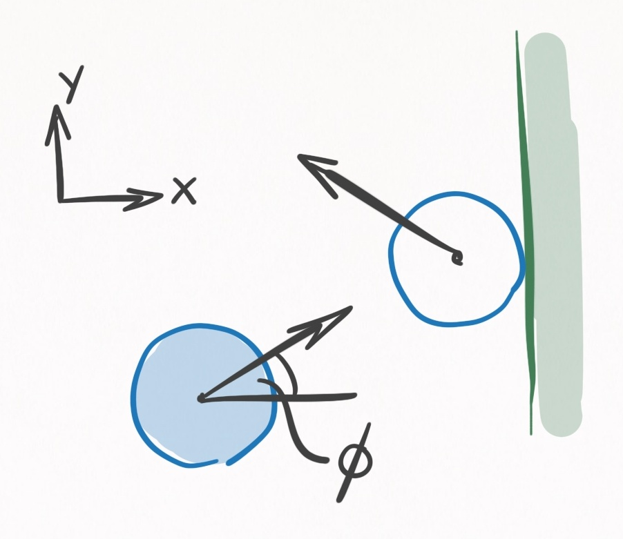{: style="width:70%; display: block; margin: 1em auto; border-radius:8px;"}

_**Figure 11**. A ball colliding with a rail viewed from above. The frame of reference is defined so that the rail is perpendicular to the $x-$axis, and the $+x=$direction points away from the playing surface. The incoming velocity makes an angle $\phi$ with the $x-$axis._

At the instant of contact, $t=\tau$, the ball has a state $(\vec{r}(\tau), \, \vec{v}(\tau), \, \vec{\omega}(\tau))$, and immediately afterwards it has the state $(\vec{r}(\tau + dt), \, \vec{v}(\tau + dt), \, \vec{ \omega}(\tau + dt))$. Since Han assumes instantaneity, $dt$ is an infinitesimal amount of time. Since there is no funny business going on with cushion deformation, we know that the position at $\tau$ will equal the position at $\tau + dt$:

$$ \vec{r}(\tau + dt) = \vec{r}(\tau) \notag $$

Resolving the velocity and angular velocity requires some geometry of the ball-cushion interface.

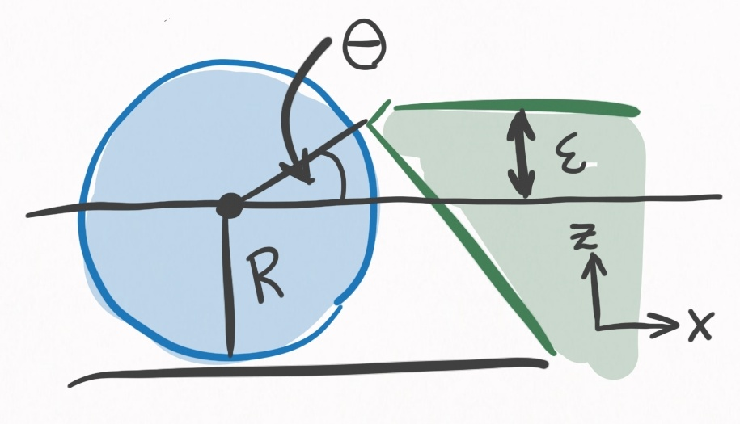{: style="width:70%; display: block; margin: 1em auto; border-radius:8px;"}

_**Figure 12**. A ball colliding with a rall viewed from the side. It is the same scenario as in [<u>**Figure 11**</u>](#Figure11). $R+\epsilon$ defines the height of the cushion, where contact is made with the ball. $\theta$ is determined uniquely by $\epsilon$, and defines the direction of the impulse the cushion imparts on the ball._

One of the most important determinants in this model, and in reality, is the height of the rail. This will determine the direction that the cushion applies force to the ball. The higher the cushion, the more the cushion redirects the ball _into_ the table. Also, the higher the cushion, the more $y-$axis torque will be applied to the ball. The cushion is specified by $\epsilon$, the height above center ball, and uniquely determines $\theta$, the angle that the line between the PoC and the center of the ball makes with the $x-$axis:

$$ \theta = \arcsin(\epsilon/R) \tag{63} $$

You may wonder, why not have $\epsilon = 0$? Then $\theta=0$ and the ball won't be redirected into the table.

This is idealistic thinking for 2 reasons. In practice, it is not uncommon for balls to leave the table when struck hard. If an airborne ball hit a rail with $\epsilon = 0$, it would go flying, so $\epsilon > 0$ protects against that.

Yet even if a ball remained firmly planted to the table, consider a rolling ball striking the cushion perpendicularly. It's spin is in the $+y-$direction of Figure [<u>**11**</u>](#Figure11) and [<u>**12**</u>](#Figure12). When in contact with the rail, the rolling spin tries to push the cushion down, and in an equal and opposite manner the cushion pushes the ball **up**, sending the ball airborne.

If you've ever played on a table with rails that pops the balls up, its probably because $\epsilon$ is too low. For these reasons, in practice $\epsilon$ is typically $0.1 R$ to $0.2 R$. This isn't a perfect solution to the airborne problem however, because as we saw in the slow mo video, redirecting the ball into the table can also cause balls to become airborne via the ball-slate interaction. That said, redirection into the slate is preferable to redirection into the air, since the slate's low coefficient of restitution dampens most of the energy.

Using rigid body dynamics, Han solves the outgoing ball state for the scenario depicted in Figures **11** and **12**.

After surveying the equations for consistency, I found 2 mistakes, that I outline in [this worksheet](assets/theory/ball_cushion_inhwan_han.pdf). The equations below have these mistakes **accounted for**.

 Ball-cushion interaction (**Han 2005 model**)

Let all of these quantities be:

$$ s_x = v_x(\tau) \sin\theta - v_y(\tau) \cos\theta + R \omega_y(\tau) \tag{64} $$

$$ s_y = -v_y(\tau) - R \omega_z(\tau) \cos\theta + R \omega_x(\tau) \sin\theta \tag{65} $$

$$ c = v_x(\tau) \cos\theta \tag{66} $$

$$ I = \frac{2}{5} m R^2 \tag{67} $$

$$ P_{zE} = m c \, (1 + e) \tag{68} $$

$$ P_{zS} = \frac{2m}{7} \sqrt{s_x^2 + s_y^2} \tag{69} $$

Displacement:

$$ \vec{r}(\tau + dt) = \vec{r}(\tau) \tag{70} $$

Velocity (if $P_{zS} \le P_{zE}$):

$$ v_x(\tau + dt) = -\frac{2}{7}s_x \sin\theta - (1+e) \, c \cos\theta \tag{71} $$

$$ v_y(\tau + dt) = \frac{2}{7}s_y \tag{72} $$

$$ v_z(\tau + dt) = \frac{2}{7}s_x \cos\theta - (1+e) \, c \sin\theta \tag{73} $$

Velocity (if $P_{zS} > P_{zE}$):

$$ v_x(\tau + dt) = -c \, (1+e) (\mu \cos\phi \sin\theta + \cos\theta) \tag{74} $$

$$ v_y(\tau + dt) = c \, (1+e) \, \mu \sin\phi \tag{75} $$

$$ v_z(\tau + dt) = c \, (1+e) (\mu \cos\phi \cos\theta - \sin\theta) \tag{76} $$

Angular velocity:

$$ \omega_x(\tau + dt) = - \frac{m R}{I} v_x(\tau + dt) \sin\theta \tag{77} $$

$$ \omega_x(\tau + dt) = \frac{m R}{I} (v_x(\tau + dt) \sin\theta - v_z(\tau+dt) \cos\theta) \tag{78} $$

$$ \omega_z(\tau + dt) = \frac{m R}{I} v_y(\tau + dt) \cos\theta \tag{79} $$

## **Section IV**: ball-air interactions

FIXME

## **Section V**: ball-slate interactions

FIXME

## **Section VI**: ball-cue interactions

FIXME

## **Conclusion**

That's everything--at least for now. My knowledge will (hopefully) increase over time, and when it does, it will be added to this post.

Next time I will be discussing the various algorithms for simulating a pool shot, and the approach I intend to take for my own simulation, which is called continuous event-based shot evolution.